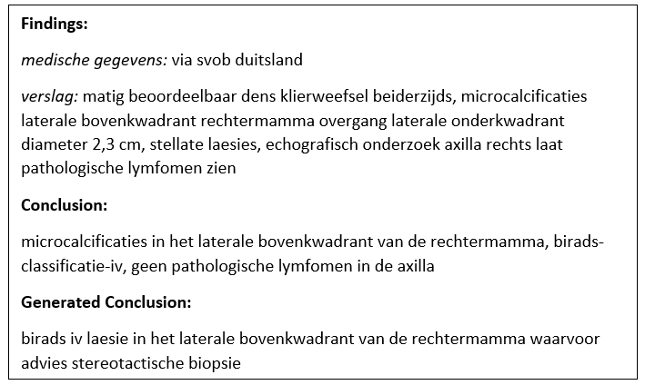

# Automated Summarization of Radiology Reports
## Abstract of the paper belonging to this implemenation
Breast cancer diagnosis is currently based on radiology reports written by humans. Manually summarizing the reports is time-consuming and leads to high text variability.
**This paper presents an automated summarization model of Dutch radiology reports using a combination of an encoder-decoder with attention and a separate BI-RADS score classifier (SVM)**. The summarization model was compared against a baseline model (encoder-decoder without attention) and performed 0.7\% better in ROUGE-L (50.8\% vs. 51.5\%). An accuracy of 83.3\% was achieved on the BI-RADS score classification. Additionally, a small qualitative evaluation with experts found the generated conclusions to be comprehensible and cover mostly relevant content, while their factual correctness is rather low. Overall, the developed model solves the summarization task well but some enhancements could improve the performance.

## Example of a report containing the findings, the original and generated conclusion

## The model setup
![Encoder-decoder model with Attention mechanism (Own diagram based on See et al. 2017 [1])](model_explanation.png "Encoder-decoder model with Attention mechanism (Own diagram based on See et al. 2017 [1]" | width=20)
Encoder-decoder model with Attention mechanism (Own diagram based on See et al. 2017 [1])

## Data
The used dataset includes roughly 50,000 breast cancer radiology reports from the Ziekenhuis Groep Twente (ZGT) hospital in Hengelo (Netherlands) recorded between 2012 and 2018. The reports are in Dutch and include data about clinical information, findings and conclusion. The clinical information and findings are treated as the input sequence. They contain the patient's medical history and result findings from the radiology procedures. This information usually indicates the breast cancer severity which is relevant for the conclusion.

## Paper
 [unpublished] \n
 E. Nguyen, D. Theodorakopoulos et al. \\
 "Automated Summarization of Radiology Reports"
 2020

## References
<a id="1">[1]</a> 
A. See, P. J. Liu, and C. D. Manning, 
“Get to the point: Summarization with pointer-generator networks”
2017
[Online]. Available: https://arxiv.org/pdf/1704.04368
